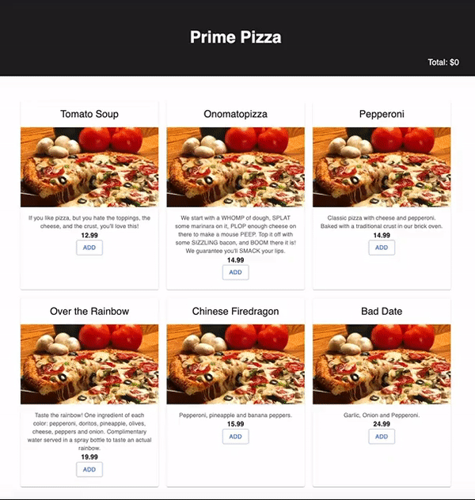

# Penguin Disco: Pizza Parlor

## Description

_Duration: 1 day Sprint_

The pizza ordering system is a web-based application that allows users to order pizzas online. The application has four pages, including Home, Customer Information, Checkout, and Admin Orders. The Home page displays available pizzas, and users can add or remove pizzas they want to order. The Enter Customer Information page collects user details, including name, address, and delivery option, and the Checkout page allows users to review their order before finalizing it. The Admin Orders page is designed for administrators to view the name, time, and order total for each order placed. Overall, the pizza ordering system provides a convenient and easy-to-use platform for ordering pizzas online.

---
## **TABLE OF CONTENT:**
1. [App Demo](#app-demo)
1. [Installation](#installation)
1. [Usage](#usage)
1. [Technologies utilization](#technologies-utilization)
1. [Acknowledgement](#acknowledgement)

---
## App Demo

---

## Installation
1. $ git clone ghttps://github.com/sollambert/redux-pizza-parlor
1. `npm install`
1. `npm run server` in your terminal
1. `npm run client` in another terminal. This should open up a new browser tab.

---

## Usage

1. Open the application in a web browser.

1. On the first page, Home, view all available pizzas and select the ones you would like to order. You can add or remove pizzas as needed, and the total cost of items in the cart will be displayed in the top right of the page.

1. Click the "Next" button to move to the second page, Customer Information. On this page, enter your name, street address, city, and zip, and select either pickup or delivery. 

1. Click the "Next" button to move to the third page, Checkout. Review your order to ensure everything is correct. Once you are satisfied, click the "Checkout" button to complete the order. 

1. Once the checkout process is complete, you will be redirected back to the Home page, and your order will be successfully placed!

1. For administrators, you can view the name, time, and order total for each of the orders placed by visiting the Admin Orders page. ADMIN ONLY use this link: [http://localhost:3000/admin](http://localhost:3000/admin)

---

## Technologies utilization 

* Javascript
* HTML
* CSS
* [React](https://reactjs.org/)
* [React Router v5](https://v5.reactrouter.com/web/guides/quick-start)
* [Redux](https://redux.js.org/)
* [Node js](https://nodejs.org/en/about/)
* [Express js](https://expressjs.com/)
* [Axio](https://axio.com/)
* [Postico 2](https://eggerapps.at/postico2/)
* [PostgreSQL](https://www.postgresql.org/)
* [Postman](https://www.postman.com/)
* [GitHub](https://github.com/xaihang/) 
* [Material UI](https://mui.com/)
* [SweetAlert2](https://sweetalert2.github.io/)

## Acknowledgement
- The Penguin Disco Pod (Anniessa, Ben, Solomon, and Xai) for their remarkable dedication, ingenuity, and outstanding teamwork. 
- Instructor: Dane 

